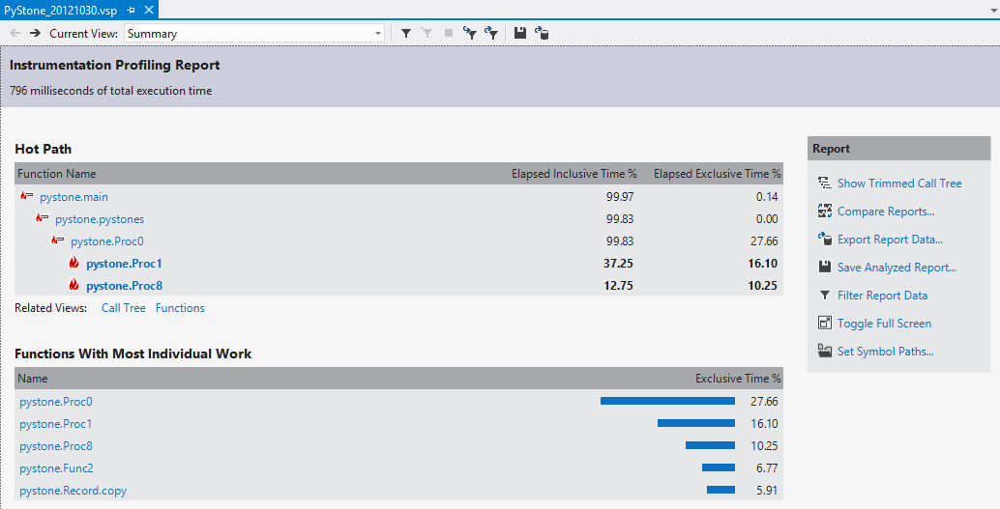

# Profiling Python Code

Visual Studio supports profiling a Python application when using CPython-based interpreters.

Profiling is started through the **Analyze > Launch Python Profiling** menu command, which opens a configuration dialog:

When you select **OK**, the profiler runs and opens a performance report through which you can explore how time is spent in the application:

For an overview, see the following

For a walkthrough demonstration, see the [Profiling with Python Tools for Visual Studio](http://www.youtube.com/watch?v=K-KqkFkp55k) video (8m52s).

> [!VIDEO https://www.youtube.com/embed/K-KqkFkp55k]

## Profiling for IronPython

Because IronPython is not a CPython-based interpreter, the profiling feature above will not work.

Instead, use the Visual Studio .NET profiler by launching `ipy.exe` directly as the target application, using the appropriate arguments to launch your startup script. Include `-X:Debug` on the command line to force all of your Python code to be debuggable and profilable. This results in a performance report including time spent both in the IronPython runtime and you code. Your code is identified using mangled names.

Alternately, IronPython has some of its own built-in profiling but there’s currently no good visualizer for it. See [An IronPython Profiler](http://blogs.msdn.com/b/curth/archive/2009/03/29/an-ironpython-profiler.aspx) (MSDN blogs) for what's available.